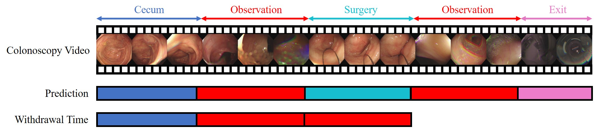

# EndoWithdrawalTime
EndoWithdrawalTime is a project for Automatic Colonoscopy Withdrawal Time Evaluation using deep learning.

## Overview



## Feature Extractor Training & Feature Extraction

For training
```python
python train.py -c configs/train/mag.json
```
For feature extraction
```python
python feature_extraction.py -c configs/test/mag.json
```

## Phase Recognition Training & Prediction

For training
```python
python main.py --action=hierarch_train --model=Hierarch_TCN --name=mag --cuda_visible_devices=0
```
For prediction
```python
python main.py --action=hierarch_predict --model=Hierarch_TCN --name=mag --cuda_visible_devices=0
